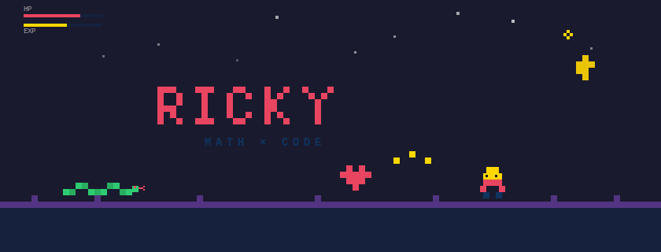

&nbsp;

PhD in Mathematics at HKUST, previously Data Science at Peking University.
I study generative models and build tools that make learning more human.
Founder of [EECS-SupportingGroup](https://github.com/EECS-SupportingGroup).

I also keep a ball python named Beatrix and play too many Souls games.

&nbsp;

&nbsp;

### Currently building

**[Alteris](https://alteris.hk)** — An AI competency platform for classrooms in Hong Kong. Students learn through project-based lessons with live AI sandboxes; teachers manage coursework and issue certifications. Built with Next.js, Hono, PostgreSQL, and LLM streaming.

**[Beatrix Cam](https://github.com/rickywesker/beatrix-cam)** — Night-vision live streaming for my pet snake. Raspberry Pi Zero 2W, Camera Module 3, 940nm infrared. She doesn't know she's on camera.

&nbsp;

### Things I work with

Python · TypeScript · C++ · PyTorch · React · Next.js · PostgreSQL · Drizzle · Docker · Tailwind

&nbsp;

### Previous work

**[Markov UST](https://github.com/rickywesker/markovust)** — Interactive visualization platform for stochastic processes, built for MATH 3425.

**[Grokking Leetcode](https://github.com/rickywesker/grokkingLeetcode)** — Pattern-based problem solving, organized by topic.

**[Deep Nets in PyTorch](https://github.com/rickywesker/implementNetinPytorch)** — Implementing architectures from papers as a learning exercise.

&nbsp;

&nbsp;

&nbsp;

*"Hesitation is defeat."*

[noparick.org](https://noparick.org)

&nbsp;

