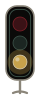
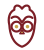

<!-- THE LATENT ROOM — a David Lynch (Twin Peaks / Red Room) profile. Assets are self-contained animated SVGs in ./assets. -->

<div align="center">



</div>

<div align="center">

[](https://noparick.org)

</div>


### PART 1 · DOSSIER &nbsp;

```
╭─ DOSSIER ──────────────────────────────────────╮
│   name      ricky · rickywesker                 │
│   location  hong kong                           │
│   phd       mathematics · hkust                 │
│   prior     data science · peking university    │
│   founder   eecs-supportinggroup                │
│   site      noparick.org                        │
│   status    ● in the lab                        │
╰─────────────────────────────────────────────────╯
```

### PART 2 · OBSESSIONS

```
╭─ OBSESSIONS ────────────────────────────────────╮
│   ·  generative models / gans / computer vision  │
│   ·  full-stack web · ai tooling                 │
│   ·  souls-likes — patience as a mechanic        │
│   ·  kaggle, late at night                       │
│   ·  one ball python named beatrix               │
╰──────────────────────────────────────────────────╯
```


### PART 3 · CASE FILES

<table>
<tr>
<td width="50%" valign="top">

** [BEATRIX CAM](https://github.com/rickywesker/beatrix-cam)**

A Pi Zero watches the snake all night in infrared. She has no idea.

`pi-zero-2w` · `opencv` · `mjpeg`

</td>
<td width="50%" valign="top">

**[MARKOV UST](https://github.com/rickywesker/markovust)**

Every step forgets the last one. The walk still ends up somewhere.

`stochastic-process` · `visualization`

</td>
</tr>
<tr>
<td width="50%" valign="top">

**[GROKKING LEETCODE](https://github.com/rickywesker/grokkingLeetcode)**

The same room from a hundred doors, until the pattern stops being a stranger.

`algorithms` · `patterns`

</td>
<td width="50%" valign="top">

**[DEEP NETS IN PYTORCH](https://github.com/rickywesker/implementNetinPytorch)**

Stacking layers until the network starts dreaming.

`pytorch` · `from-scratch`

</td>
</tr>
</table>

### PART 4 · WHAT I CARRY

<div align="center">

    

   

    

</div>


### PART 5 · TRANSMISSIONS

<div align="center">


<sub>transmissions received nightly.</sub>

<!-- Snake populates after snake.yml runs once: Actions tab → "generate snake" → Run workflow. -->


</div>


<div align="center">



*The owls are not what they seem.*

<sub>— end of part 1 · the dream is patient · <a href="https://noparick.org">noparick.org</a></sub>

</div>
